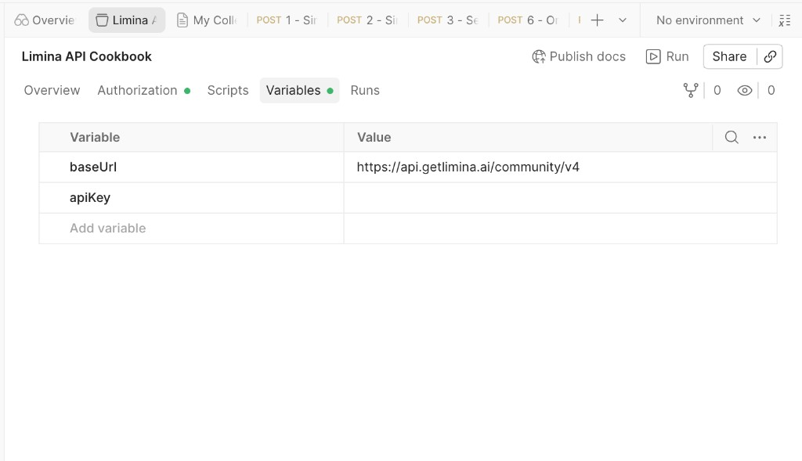

# Introduction

This repository contains examples that showcase how to use Limina's Community RESTful API using Postman.

## Setup

Download and install [Postman](https://www.postman.com/downloads/).

Download the [Limina API Cookbook postman collection](./Limina%20API%20Cookbook.postman_collection.json) and then [import them into Postman](https://learning.postman.com/docs/getting-started/importing-and-exporting/importing-data/).

To use the Community API, [sign up or sign in](https://portal.getlimina.ai/) to the Limina Customer Portal and get a free API key. 

Within Postman, click on the Limina API Cookbook and select the Authorization tab. Paste your Community API key into the Value field, and then try out the examples.\

## Additonal Information
These examples were tested against Limina API version 4.5.0
