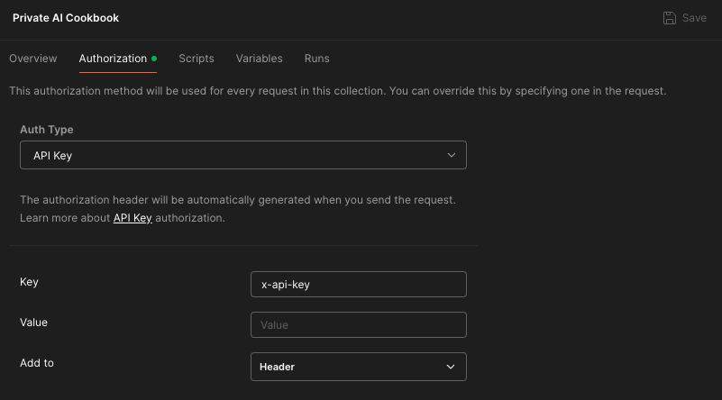

# Introduction

This repository contains examples that showcase how to use the Private AI's Community RESTful API using Postman.

## Setup

Download and install [Postman](https://www.postman.com/downloads/).

Download the [Private AI Cookbook postman collection](./Private%20AI%20Cookbook.postman_collection.json) and then [import them into Postman](https://learning.postman.com/docs/getting-started/importing-and-exporting/importing-data/).

To use the Community API, [sign up or sign in](https://private-ai.com/start-api) to the Private AI Customer Portal and get a free API key. 

Within Postman, click on the Private AI Cookbook and select the Authorization tab. Paste your Community API key into the Value field, and then try out the examples.

## Additonal Information
These examples were tested against Private AI API version 3.8.2
